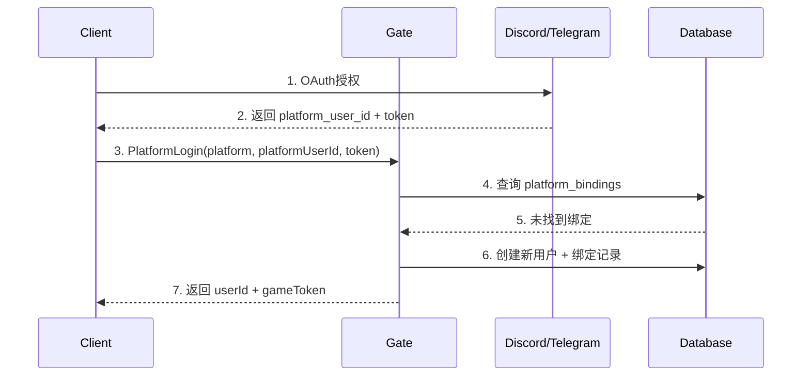
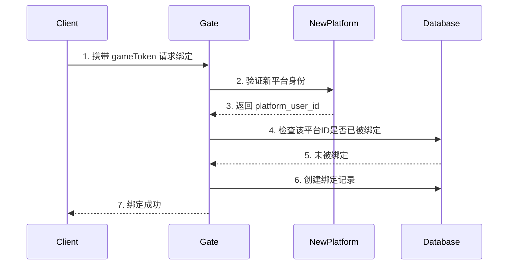
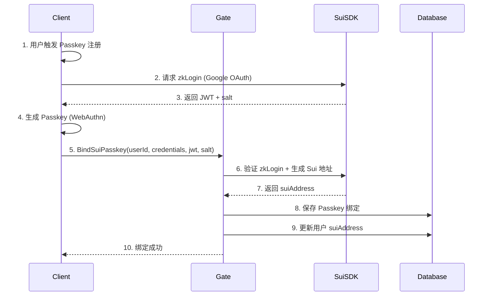

# 🔐 多平台身份统一方案 + Sui Passkey 集成

**项目**: OOPS-MOBA
**目标**: 统一管理 Discord、Telegram、Web、移动端等多平台身份，并集成 Sui Passkey
**更新时间**: 2025-12-04

---

## 📊 需求分析

### 支持的平台
1. **Discord** - Discord Bot 登录
2. **Telegram** - Telegram Bot/Mini App 登录
3. **Web浏览器** - 支持 Passkey (WebAuthn)
4. **移动端** - iOS/Android App（支持生物识别 Passkey）
5. **其他** - 微信、Line等（预留）

### 核心需求
- ✅ 每个平台有自己的用户ID（Discord ID、Telegram ID等）
- ✅ 一个游戏账号可以绑定多个平台身份
- ✅ 通过任一平台登录都能访问同一游戏账号
- ✅ 集成 Sui Passkey 作为 Web3 身份和资产管理
- ✅ 安全的跨平台身份验证

---

## 🎯 核心架构设计

### 1. 账号体系架构

```
统一游戏账号 (Unified Account)
    └── userId (唯一游戏ID)
        ├── 平台账号绑定 (Platform Bindings)
        │   ├── Discord: discordId + accessToken
        │   ├── Telegram: telegramId + authHash
        │   ├── Email/Username: email + password
        │   └── Phone: phoneNumber + verificationCode
        │
        └── Web3 身份 (Sui Passkey)
            ├── Sui Address (zkLogin 生成)
            ├── Passkey Credentials
            └── NFT/Token 资产关联
```

### 2. 数据库结构设计

#### 2.1 用户主表 (users)

```typescript
interface User {
    _id: ObjectId;
    userId: string;              // 游戏唯一ID
    username: string;            // 游戏昵称

    // 游戏数据
    gold: number;
    level: number;
    exp: number;
    lastLoginTime: number;
    createdAt: number;

    // 平台绑定状态（快速查询）
    boundPlatforms: string[];    // ['discord', 'telegram', 'sui']

    // Web3 身份
    suiAddress?: string;         // Sui 钱包地址
    hasPasskey: boolean;         // 是否绑定了 Passkey
}
```

#### 2.2 平台身份绑定表 (platform_bindings)

```typescript
interface PlatformBinding {
    _id: ObjectId;
    userId: string;              // 关联的游戏账号ID
    platform: PlatformType;      // 平台类型
    platformUserId: string;      // 平台的用户ID
    platformUsername?: string;   // 平台用户名

    // 认证信息
    accessToken?: string;        // OAuth token
    refreshToken?: string;
    tokenExpiry?: number;

    // 平台特定数据
    metadata: Record<string, any>; // 平台特定信息

    // 绑定信息
    bindTime: number;            // 绑定时间
    lastLoginTime: number;       // 最后登录时间
    isActive: boolean;           // 是否激活
}

enum PlatformType {
    Discord = 'discord',
    Telegram = 'telegram',
    Email = 'email',
    Phone = 'phone',
    Twitter = 'twitter',
    Google = 'google',
    Sui = 'sui',                 // Sui Passkey
    Apple = 'apple',
    WeChat = 'wechat'
}
```

#### 2.3 Sui Passkey 绑定表 (sui_passkeys)

```typescript
interface SuiPasskey {
    _id: ObjectId;
    userId: string;              // 关联的游戏账号ID
    suiAddress: string;          // zkLogin 生成的 Sui 地址

    // Passkey 信息
    credentialId: string;        // WebAuthn Credential ID
    publicKey: string;           // 公钥
    counter: number;             // 签名计数器

    // zkLogin 相关
    jwt: string;                 // OAuth JWT token
    salt: string;                // zkLogin salt
    proof?: string;              // zkLogin proof

    // 平台信息
    oidcProvider: string;        // 'google' | 'twitch' | 'facebook'
    oidcSubject: string;         // OAuth subject (用户唯一标识)

    // NFT/资产关联
    nftCollections: string[];    // 拥有的 NFT 合约地址
    tokenBalances: TokenBalance[];

    // 绑定信息
    bindTime: number;
    lastUsedTime: number;
    isActive: boolean;
}

interface TokenBalance {
    coinType: string;            // Sui 代币类型
    balance: string;             // 余额
    decimals: number;
}
```

---

## 🔄 登录流程设计

### 方案 A: 统一账号为主（推荐）⭐

**特点**: 先创建游戏账号，再绑定各平台

#### 流程 1: 首次登录（任意平台）



#### 流程 2: 已有账号，添加新平台



#### 流程 3: 绑定 Sui Passkey



---

### 方案 B: 平台账号为主

**特点**: 每个平台账号独立，后台自动合并

这个方案更复杂，不推荐。方案A更清晰明确。

---

## 🛠️ API 设计

### 1. 平台登录 API

#### ApiPlatformLogin - 通过平台账号登录

```typescript
// 协议定义
interface ReqPlatformLogin {
    platform: PlatformType;      // 平台类型
    platformUserId: string;      // 平台用户ID
    accessToken: string;         // 平台 access token
    platformUsername?: string;   // 平台用户名（可选）
}

interface ResPlatformLogin {
    userId: string;              // 游戏账号ID
    gameToken: string;           // 游戏 token
    isNewUser: boolean;          // 是否新用户

    // 用户基础信息
    username: string;
    gold: number;
    level: number;

    // 绑定信息
    boundPlatforms: string[];
    hasPasskey: boolean;
    suiAddress?: string;
}

// 实现逻辑
export async function ApiPlatformLogin(call: ApiCall<ReqPlatformLogin, ResPlatformLogin>) {
    const { platform, platformUserId, accessToken, platformUsername } = call.req;

    // 1. 验证平台 token
    const isValid = await verifyPlatformToken(platform, platformUserId, accessToken);
    if (!isValid) {
        return call.error('Invalid platform credentials');
    }

    // 2. 查询是否已绑定
    let binding = await PlatformBindingDB.findByPlatform(platform, platformUserId);
    let user: User;
    let isNewUser = false;

    if (!binding) {
        // 3a. 新用户：创建账号 + 绑定
        user = await UserDB.createUser({
            username: platformUsername || `${platform}_${platformUserId.slice(0, 8)}`,
            boundPlatforms: [platform]
        });

        binding = await PlatformBindingDB.create({
            userId: user.userId,
            platform,
            platformUserId,
            platformUsername,
            accessToken,
            bindTime: Date.now(),
            lastLoginTime: Date.now(),
            isActive: true
        });

        isNewUser = true;
    } else {
        // 3b. 老用户：更新登录时间
        user = await UserDB.getUser(binding.userId);
        await PlatformBindingDB.updateLoginTime(binding._id);
        await UserDB.updateLoginTime(user.userId);
    }

    // 4. 生成游戏 token
    const gameToken = generateGameToken(user.userId);

    // 5. 返回
    call.succ({
        userId: user.userId,
        gameToken,
        isNewUser,
        username: user.username,
        gold: user.gold,
        level: user.level,
        boundPlatforms: user.boundPlatforms,
        hasPasskey: user.hasPasskey,
        suiAddress: user.suiAddress
    });
}
```

---

### 2. 绑定新平台 API

#### ApiBindPlatform - 为现有账号绑定新平台

```typescript
interface ReqBindPlatform {
    gameToken: string;           // 当前游戏 token
    platform: PlatformType;      // 要绑定的平台
    platformUserId: string;      // 平台用户ID
    accessToken: string;         // 平台 token
}

interface ResBindPlatform {
    success: boolean;
    boundPlatforms: string[];    // 更新后的绑定列表
}

export async function ApiBindPlatform(call: ApiCall<ReqBindPlatform, ResBindPlatform>) {
    const { gameToken, platform, platformUserId, accessToken } = call.req;

    // 1. 验证游戏 token
    const userId = verifyGameToken(gameToken);
    if (!userId) {
        return call.error('Invalid game token');
    }

    // 2. 验证平台 token
    const isValid = await verifyPlatformToken(platform, platformUserId, accessToken);
    if (!isValid) {
        return call.error('Invalid platform credentials');
    }

    // 3. 检查该平台ID是否已被其他账号绑定
    const existingBinding = await PlatformBindingDB.findByPlatform(platform, platformUserId);
    if (existingBinding && existingBinding.userId !== userId) {
        return call.error('Platform account already bound to another user');
    }

    // 4. 检查该账号是否已绑定此平台
    if (existingBinding && existingBinding.userId === userId) {
        return call.error('Platform already bound to this account');
    }

    // 5. 创建绑定
    await PlatformBindingDB.create({
        userId,
        platform,
        platformUserId,
        accessToken,
        bindTime: Date.now(),
        lastLoginTime: Date.now(),
        isActive: true
    });

    // 6. 更新用户绑定列表
    const user = await UserDB.addBoundPlatform(userId, platform);

    call.succ({
        success: true,
        boundPlatforms: user.boundPlatforms
    });
}
```

---

### 3. Sui Passkey 集成 API

#### ApiBindSuiPasskey - 绑定 Sui Passkey

```typescript
interface ReqBindSuiPasskey {
    gameToken: string;

    // Passkey 信息
    credentialId: string;
    publicKey: string;

    // zkLogin 信息
    jwt: string;                 // OAuth JWT
    salt: string;                // zkLogin salt
    oidcProvider: string;        // 'google' | 'twitch' | 'facebook'
    oidcSubject: string;         // OAuth subject
}

interface ResBindSuiPasskey {
    success: boolean;
    suiAddress: string;          // 生成的 Sui 地址
}

export async function ApiBindSuiPasskey(call: ApiCall<ReqBindSuiPasskey, ResBindSuiPasskey>) {
    const { gameToken, credentialId, publicKey, jwt, salt, oidcProvider, oidcSubject } = call.req;

    // 1. 验证游戏 token
    const userId = verifyGameToken(gameToken);
    if (!userId) {
        return call.error('Invalid game token');
    }

    // 2. 验证 JWT
    const isValidJWT = await verifyOAuthJWT(jwt, oidcProvider);
    if (!isValidJWT) {
        return call.error('Invalid JWT');
    }

    // 3. 生成 Sui 地址 (zkLogin)
    const suiAddress = await generateZkLoginAddress(jwt, salt, oidcProvider, oidcSubject);

    // 4. 检查该 Sui 地址是否已被绑定
    const existing = await SuiPasskeyDB.findByAddress(suiAddress);
    if (existing && existing.userId !== userId) {
        return call.error('Sui address already bound to another user');
    }

    // 5. 保存 Passkey 绑定
    await SuiPasskeyDB.create({
        userId,
        suiAddress,
        credentialId,
        publicKey,
        counter: 0,
        jwt,
        salt,
        oidcProvider,
        oidcSubject,
        nftCollections: [],
        tokenBalances: [],
        bindTime: Date.now(),
        lastUsedTime: Date.now(),
        isActive: true
    });

    // 6. 更新用户信息
    await UserDB.update(userId, {
        suiAddress,
        hasPasskey: true,
        boundPlatforms: [...user.boundPlatforms, 'sui']
    });

    call.succ({
        success: true,
        suiAddress
    });
}
```

#### ApiLoginWithPasskey - 使用 Passkey 登录

```typescript
interface ReqLoginWithPasskey {
    credentialId: string;
    signature: string;           // WebAuthn 签名
    challenge: string;           // 服务器下发的挑战
    authenticatorData: string;
    clientDataJSON: string;
}

interface ResLoginWithPasskey {
    userId: string;
    gameToken: string;
    username: string;
    gold: number;
    suiAddress: string;
}

export async function ApiLoginWithPasskey(call: ApiCall<ReqLoginWithPasskey, ResLoginWithPasskey>) {
    const { credentialId, signature, challenge, authenticatorData, clientDataJSON } = call.req;

    // 1. 查找 Passkey
    const passkey = await SuiPasskeyDB.findByCredentialId(credentialId);
    if (!passkey) {
        return call.error('Passkey not found');
    }

    // 2. 验证 WebAuthn 签名
    const isValid = await verifyWebAuthnSignature({
        publicKey: passkey.publicKey,
        signature,
        challenge,
        authenticatorData,
        clientDataJSON
    });

    if (!isValid) {
        return call.error('Invalid signature');
    }

    // 3. 更新计数器（防重放攻击）
    await SuiPasskeyDB.updateCounter(passkey._id, passkey.counter + 1);

    // 4. 获取用户信息
    const user = await UserDB.getUser(passkey.userId);

    // 5. 生成游戏 token
    const gameToken = generateGameToken(user.userId);

    // 6. 更新登录时间
    await UserDB.updateLoginTime(user.userId);
    await SuiPasskeyDB.updateLastUsedTime(passkey._id);

    call.succ({
        userId: user.userId,
        gameToken,
        username: user.username,
        gold: user.gold,
        suiAddress: passkey.suiAddress
    });
}
```

---

### 4. 查询绑定状态 API

#### ApiGetBindings - 获取账号绑定信息

```typescript
interface ReqGetBindings {
    gameToken: string;
}

interface ResGetBindings {
    userId: string;
    bindings: PlatformBindingInfo[];
    suiPasskey?: SuiPasskeyInfo;
}

interface PlatformBindingInfo {
    platform: PlatformType;
    platformUsername: string;
    bindTime: number;
    lastLoginTime: number;
}

interface SuiPasskeyInfo {
    suiAddress: string;
    bindTime: number;
    nftCount: number;
    tokenBalances: TokenBalance[];
}
```

---

## 🔐 平台身份验证实现

### Discord OAuth 验证

```typescript
async function verifyDiscordToken(discordUserId: string, accessToken: string): Promise<boolean> {
    try {
        const response = await fetch('https://discord.com/api/users/@me', {
            headers: {
                'Authorization': `Bearer ${accessToken}`
            }
        });

        if (!response.ok) return false;

        const userData = await response.json();
        return userData.id === discordUserId;
    } catch (error) {
        console.error('Discord verification failed:', error);
        return false;
    }
}
```

### Telegram Bot 验证

```typescript
import crypto from 'crypto';

async function verifyTelegramAuth(initData: string, botToken: string): Promise<boolean> {
    // Telegram Mini App 验证算法
    const urlParams = new URLSearchParams(initData);
    const hash = urlParams.get('hash');
    urlParams.delete('hash');

    // 按字母顺序排序参数
    const dataCheckString = Array.from(urlParams.entries())
        .sort(([a], [b]) => a.localeCompare(b))
        .map(([key, value]) => `${key}=${value}`)
        .join('\n');

    // 计算密钥
    const secretKey = crypto
        .createHmac('sha256', 'WebAppData')
        .update(botToken)
        .digest();

    // 计算 hash
    const calculatedHash = crypto
        .createHmac('sha256', secretKey)
        .update(dataCheckString)
        .digest('hex');

    return calculatedHash === hash;
}
```

---

## 🌐 前端集成示例

### Discord 登录

```typescript
// Discord OAuth 流程
class DiscordAuth {
    static CLIENT_ID = 'your_discord_client_id';
    static REDIRECT_URI = 'your_redirect_uri';

    static getAuthUrl(): string {
        return `https://discord.com/api/oauth2/authorize?client_id=${this.CLIENT_ID}&redirect_uri=${encodeURIComponent(this.REDIRECT_URI)}&response_type=token&scope=identify`;
    }

    static async loginWithDiscord() {
        // 1. 打开 Discord OAuth 页面
        const authUrl = this.getAuthUrl();
        window.location.href = authUrl;

        // 2. 回调后处理
        // 从 URL hash 中获取 access_token
        const params = new URLSearchParams(window.location.hash.slice(1));
        const accessToken = params.get('access_token');

        // 3. 获取 Discord 用户信息
        const userResponse = await fetch('https://discord.com/api/users/@me', {
            headers: { 'Authorization': `Bearer ${accessToken}` }
        });
        const discordUser = await userResponse.json();

        // 4. 调用游戏服务器登录
        const res = await NetworkManager.instance.gate.client!.callApi('PlatformLogin', {
            platform: 'discord',
            platformUserId: discordUser.id,
            accessToken: accessToken,
            platformUsername: discordUser.username
        });

        if (res.isSucc) {
            // 登录成功
            GameDataManager.instance.setUserData(res.res);
        }
    }
}
```

### Telegram Mini App 登录

```typescript
// Telegram WebApp
class TelegramAuth {
    static async loginWithTelegram() {
        // Telegram Mini App 自动提供用户信息
        const telegram = (window as any).Telegram.WebApp;
        const initData = telegram.initData;
        const user = telegram.initDataUnsafe.user;

        if (!user) {
            throw new Error('Telegram user not found');
        }

        // 调用游戏服务器登录
        const res = await NetworkManager.instance.gate.client!.callApi('PlatformLogin', {
            platform: 'telegram',
            platformUserId: user.id.toString(),
            accessToken: initData,  // 使用 initData 作为验证凭证
            platformUsername: user.username || user.first_name
        });

        if (res.isSucc) {
            GameDataManager.instance.setUserData(res.res);
        }
    }
}
```

### Sui Passkey 注册

```typescript
import { Ed25519Keypair } from '@mysten/sui.js/keypairs/ed25519';
import { generateNonce, generateRandomness } from '@mysten/zklogin';

class SuiPasskeyAuth {
    static async registerPasskey() {
        // 1. 用户选择 OAuth 提供商（Google、Twitch 等）
        const provider = 'google';

        // 2. 生成 zkLogin 参数
        const ephemeralKeyPair = new Ed25519Keypair();
        const randomness = generateRandomness();
        const nonce = generateNonce(ephemeralKeyPair.getPublicKey(), randomness);

        // 3. OAuth 授权（获取 JWT）
        const jwt = await this.getOAuthJWT(provider, nonce);

        // 4. 创建 Passkey（WebAuthn）
        const credential = await navigator.credentials.create({
            publicKey: {
                challenge: new TextEncoder().encode(nonce),
                rp: { name: 'OOPS-MOBA' },
                user: {
                    id: new TextEncoder().encode(Date.now().toString()),
                    name: 'user@example.com',
                    displayName: 'Game Player'
                },
                pubKeyCredParams: [{ alg: -7, type: 'public-key' }],
                authenticatorSelection: {
                    authenticatorAttachment: 'platform',
                    userVerification: 'required'
                }
            }
        }) as PublicKeyCredential;

        // 5. 提取 credential 信息
        const response = credential.response as AuthenticatorAttestationResponse;
        const credentialId = credential.id;
        const publicKey = this.extractPublicKey(response);

        // 6. 调用游戏服务器绑定
        const res = await NetworkManager.instance.gate.client!.callApi('BindSuiPasskey', {
            gameToken: GameDataManager.instance.gameToken,
            credentialId,
            publicKey,
            jwt,
            salt: randomness,
            oidcProvider: provider,
            oidcSubject: this.extractSubject(jwt)
        });

        if (res.isSucc) {
            console.log('Sui address:', res.res.suiAddress);
        }
    }

    static async getOAuthJWT(provider: string, nonce: string): Promise<string> {
        // 实现 OAuth 流程获取 JWT
        // 这里简化处理，实际需要完整的 OAuth 流程
        const authUrl = `https://accounts.google.com/o/oauth2/v2/auth?` +
            `client_id=YOUR_CLIENT_ID&` +
            `redirect_uri=YOUR_REDIRECT&` +
            `response_type=id_token&` +
            `scope=openid&` +
            `nonce=${nonce}`;

        // 打开授权页面并获取 id_token
        // ...
        return 'jwt_token';
    }
}
```

---

## 📦 数据库 Schema 创建脚本

```typescript
// initialize-auth-schema.ts
import { MongoClient } from 'mongodb';

async function initializeAuthSchema() {
    const client = new MongoClient('mongodb://localhost:27017');
    await client.connect();
    const db = client.db('oops-framework');

    console.log('🔐 初始化多平台认证系统...\n');

    // 1. 创建平台绑定集合
    console.log('[1/3] 创建 platform_bindings 集合...');
    const bindingsCollection = db.collection('platform_bindings');
    await bindingsCollection.createIndex(
        { platform: 1, platformUserId: 1 },
        { unique: true }
    );
    await bindingsCollection.createIndex({ userId: 1 });
    console.log('  ✓ platform_bindings 索引创建完成\n');

    // 2. 创建 Sui Passkey 集合
    console.log('[2/3] 创建 sui_passkeys 集合...');
    const passkeysCollection = db.collection('sui_passkeys');
    await passkeysCollection.createIndex({ userId: 1 });
    await passkeysCollection.createIndex({ suiAddress: 1 }, { unique: true });
    await passkeysCollection.createIndex({ credentialId: 1 }, { unique: true });
    console.log('  ✓ sui_passkeys 索引创建完成\n');

    // 3. 更新用户表结构（添加新字段）
    console.log('[3/3] 更新 users 集合...');
    const usersCollection = db.collection('users');
    await usersCollection.updateMany(
        {},
        {
            $set: {
                boundPlatforms: [],
                hasPasskey: false
            }
        }
    );
    console.log('  ✓ users 集合更新完成\n');

    console.log('✅ 多平台认证系统初始化完成！');

    await client.close();
}

initializeAuthSchema();
```

---

## 🎯 实施步骤

### Phase 1: 基础多平台登录（1-2天）

1. **数据库准备**
   - 创建 `platform_bindings` 集合
   - 更新 `users` 表结构
   - 运行初始化脚本

2. **后端实现**
   - 实现 `ApiPlatformLogin`
   - 实现 `ApiBindPlatform`
   - 实现 `ApiGetBindings`
   - 实现各平台 token 验证

3. **前端实现**
   - Discord OAuth 集成
   - Telegram WebApp 集成
   - 登录选择界面

### Phase 2: Sui Passkey 集成（2-3天）

1. **依赖安装**
```bash
npm install @mysten/sui.js @mysten/zklogin
npm install @simplewebauthn/browser @simplewebauthn/server
```

2. **后端实现**
   - 创建 `sui_passkeys` 集合
   - 实现 `ApiBindSuiPasskey`
   - 实现 `ApiLoginWithPasskey`
   - 集成 zkLogin SDK

3. **前端实现**
   - Passkey 注册流程
   - Passkey 登录流程
   - Sui 资产显示

### Phase 3: 测试和优化（1天）

1. **功能测试**
   - 各平台登录测试
   - 绑定/解绑测试
   - Passkey 流程测试

2. **安全加固**
   - Token 过期机制
   - Rate limiting
   - 防重放攻击

---

## 🔒 安全注意事项

### 1. Token 安全
- ✅ 所有 token 加密存储
- ✅ 设置 token 过期时间
- ✅ 实现 refresh token 机制
- ✅ 防止 token 泄露

### 2. 跨平台安全
- ✅ 验证所有平台 token 的真实性
- ✅ 防止同一平台账号绑定多个游戏账号
- ✅ 实现账号解绑功能
- ✅ 记录所有绑定操作日志

### 3. Passkey 安全
- ✅ 使用 WebAuthn 标准
- ✅ 验证 authenticator data
- ✅ 防重放攻击（counter 机制）
- ✅ 安全存储私钥和凭证

### 4. zkLogin 安全
- ✅ 验证 OAuth JWT 签名
- ✅ 检查 JWT 过期时间
- ✅ 安全存储 salt 和 proof
- ✅ 使用 HTTPS 传输

---

## 📊 预期效果

### 用户体验
- ✅ 一键登录（各平台）
- ✅ 无需记住密码
- ✅ 跨平台数据互通
- ✅ Web3 资产无缝集成

### 技术优势
- ✅ 统一的账号体系
- ✅ 灵活的平台扩展
- ✅ 去中心化身份（Sui）
- ✅ 高安全性（Passkey）

### 商业价值
- ✅ 降低注册门槛
- ✅ 提高用户留存
- ✅ 支持多渠道获客
- ✅ Web3 生态集成

---

## 📚 相关资源

### 官方文档
- [Discord OAuth2](https://discord.com/developers/docs/topics/oauth2)
- [Telegram Mini Apps](https://core.telegram.org/bots/webapps)
- [Sui zkLogin](https://docs.sui.io/concepts/cryptography/zklogin)
- [WebAuthn API](https://developer.mozilla.org/en-US/docs/Web/API/Web_Authentication_API)

### SDK 文档
- [@mysten/sui.js](https://www.npmjs.com/package/@mysten/sui.js)
- [@simplewebauthn/browser](https://www.npmjs.com/package/@simplewebauthn/browser)

---

## ✅ 总结

这个方案实现了：

1. **统一账号体系** - 一个游戏账号绑定多个平台
2. **灵活登录方式** - Discord、Telegram、Passkey 等
3. **Web3 集成** - Sui Passkey + zkLogin
4. **安全可靠** - 多重验证机制
5. **易于扩展** - 可轻松添加新平台

**预计开发时间**: 4-6天
**核心工作量**: 后端API实现 + 前端OAuth集成 + Sui zkLogin集成

需要我帮你实现具体的某个部分吗？比如 Discord OAuth 或 Sui Passkey 的完整代码？

---

**文档维护**: Claude Code
**最后更新**: 2025-12-04
**版本**: v1.0
