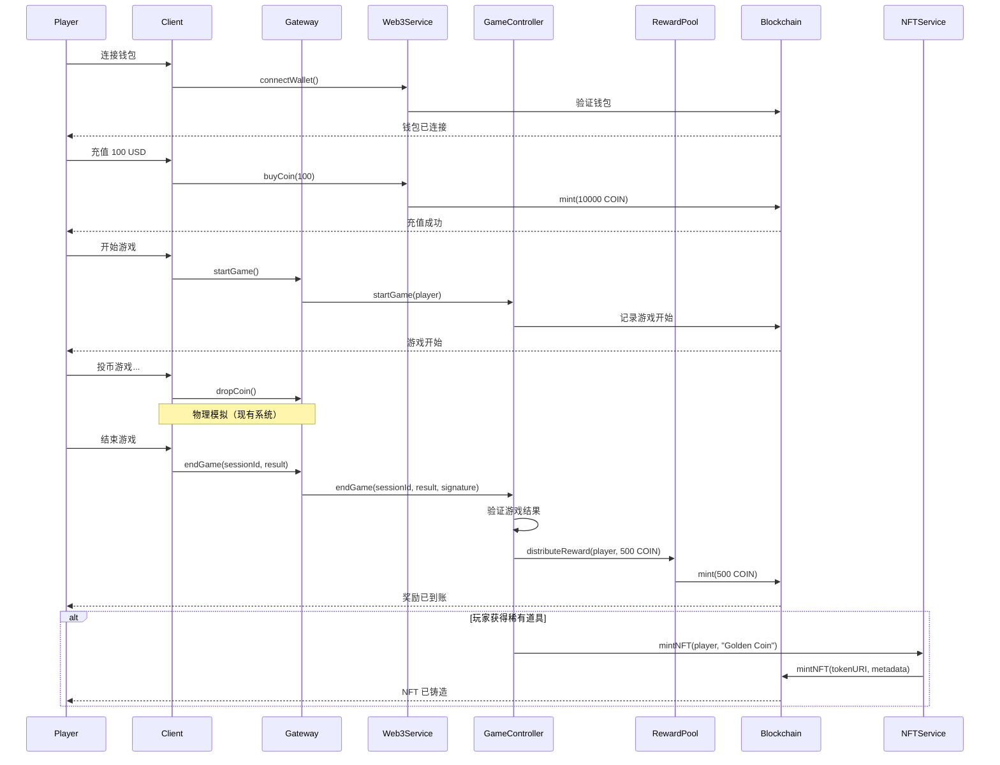

# 🌐 Web3 系统架构设计

**版本**: 1.0.0
**日期**: 2025-12-01
**状态**: 设计完成，待实现

---

## 📊 系统概述

为推币机游戏设计的完整 Web3 集成方案，实现：
- 🪙 **ERC-20 游戏代币**（$COIN）
- 🎨 **ERC-721 NFT 系统**（道具、皮肤、特殊硬币）
- 🏆 **智能合约奖励池**
- 🔗 **链上游戏记录**
- 💰 **自动奖励分发**

---

## 🏗️ 架构分层

```
┌─────────────────────────────────────────┐
│         Client Layer（客户端层）         │
│  - MetaMask 钱包连接                     │
│  - 交易签名                              │
│  - NFT 展示                              │
└─────────────────┬───────────────────────┘
                  │
┌─────────────────▼───────────────────────┐
│       Web3 Service Layer（服务层）      │
│  - WalletService: 钱包管理              │
│  - TokenService: 代币操作               │
│  - NFTService: NFT 铸造/交易            │
│  - RewardService: 奖励分发              │
└─────────────────┬───────────────────────┘
                  │
┌─────────────────▼───────────────────────┐
│     Smart Contracts Layer（合约层）     │
│  - GameToken (ERC-20)                   │
│  - CoinPusherNFT (ERC-721)              │
│  - RewardPool                           │
│  - GameController                       │
└─────────────────┬───────────────────────┘
                  │
┌─────────────────▼───────────────────────┐
│       Blockchain Layer（区块链层）      │
│  - Ethereum / Polygon / BSC             │
│  - IPFS (NFT 元数据存储)                │
└─────────────────────────────────────────┘
```

---

## 💰 智能合约设计

### 1. GameToken.sol (ERC-20)

**功能**:
- 游戏内代币 $COIN
- 可用于：投币、购买道具、NFT 交易
- 总供应量: 1,000,000,000 COIN
- 可销毁、可铸造（仅游戏合约）

**核心方法**:
```solidity
contract GameToken is ERC20, Ownable {
    function mint(address to, uint256 amount) external onlyGame;
    function burn(uint256 amount) external;
    function transfer(address to, uint256 amount) external returns (bool);

    // 游戏奖励铸造（有上限）
    function mintReward(address player, uint256 amount) external onlyGame;
}
```

**代币经济**:
- 1 COIN = 0.001 USD（初始价格）
- 玩家充值: USD → COIN
- 游戏奖励: 自动铸造 COIN
- 提现: COIN → USD（需要满足条件）

---

### 2. CoinPusherNFT.sol (ERC-721)

**功能**:
- NFT 道具系统
- 类型: 特殊硬币、皮肤、道具、成就徽章
- 稀有度: Common、Rare、Epic、Legendary
- 可交易、可合成

**NFT 类型**:

| 类型 | 描述 | 稀有度 | 效果 |
|------|------|--------|------|
| **Golden Coin** | 黄金硬币 | Epic | 价值 10x 普通硬币 |
| **Diamond Coin** | 钻石硬币 | Legendary | 价值 100x，自带磁力 |
| **Lucky Pusher** | 幸运推手 | Rare | 提升 20% 掉落率 |
| **Magnet Field** | 磁场道具 | Epic | 吸引附近硬币 |
| **Achievement Badge** | 成就徽章 | Common-Legendary | 记录游戏成就 |

**核心方法**:
```solidity
contract CoinPusherNFT is ERC721URIStorage, Ownable {
    struct NFTMetadata {
        string name;
        string rarity;      // Common, Rare, Epic, Legendary
        string nftType;     // Coin, Skin, Item, Badge
        uint256 power;      // 效果强度
        uint256 mintTime;
    }

    function mintNFT(address player, string memory tokenURI, NFTMetadata memory metadata) external onlyGame returns (uint256);
    function burnNFT(uint256 tokenId) external;
    function upgradeNFT(uint256 tokenId, uint256 newPower) external;

    // NFT 合成（3个相同稀有度 → 1个更高稀有度）
    function combineNFTs(uint256[] calldata tokenIds) external returns (uint256);
}
```

---

### 3. RewardPool.sol

**功能**:
- 奖励池管理
- 自动奖励分发
- 防作弊机制
- 奖励上限控制

**核心逻辑**:
```solidity
contract RewardPool is Ownable, ReentrancyGuard {
    // 奖励配置
    struct RewardConfig {
        uint256 dailyLimit;        // 每日奖励上限
        uint256 perGameLimit;      // 单局奖励上限
        uint256 minPlayTime;       // 最小游戏时长（防刷）
        uint256 cooldownPeriod;    // 冷却时间
    }

    // 发放奖励（由 GameController 调用）
    function distributeReward(
        address player,
        uint256 amount,
        bytes32 gameSessionId
    ) external onlyGameController nonReentrant;

    // 查询玩家今日已领取奖励
    function getTodayRewards(address player) external view returns (uint256);

    // 充值奖励池
    function depositPool() external payable onlyOwner;

    // 提取奖励池（仅管理员，需多签）
    function withdrawPool(uint256 amount) external onlyOwner;
}
```

**防刷机制**:
- ✅ 每日奖励上限: 1000 COIN/玩家
- ✅ 单局奖励上限: 100 COIN
- ✅ 最小游戏时长: 60秒
- ✅ 冷却时间: 30秒/局
- ✅ 异常检测: 自动封禁可疑账户

---

### 4. GameController.sol

**功能**:
- 游戏逻辑控制
- 游戏记录上链
- 奖励计算和分发
- 反作弊验证

**核心方法**:
```solidity
contract GameController is Ownable {
    struct GameSession {
        address player;
        uint256 startTime;
        uint256 endTime;
        uint256 coinsDropped;
        uint256 coinsCollected;
        uint256 rewardEarned;
        bytes32 sessionId;
        bool verified;
    }

    // 开始游戏
    function startGame(address player) external onlyBackend returns (bytes32 sessionId);

    // 结束游戏并计算奖励
    function endGame(
        bytes32 sessionId,
        uint256 coinsCollected,
        bytes calldata signature  // 后端签名，防伪造
    ) external returns (uint256 rewardAmount);

    // 验证游戏结果（后端服务器签名）
    function verifyGameResult(
        bytes32 sessionId,
        uint256 coinsCollected,
        bytes calldata signature
    ) external view returns (bool);

    // 查询游戏历史
    function getGameHistory(address player, uint256 limit) external view returns (GameSession[] memory);
}
```

---

## 🔧 Web3 服务层设计

### 1. WalletService.ts

**功能**: 钱包连接和管理

```typescript
class WalletService {
    // 连接钱包（MetaMask、WalletConnect 等）
    async connectWallet(provider: 'metamask' | 'walletconnect'): Promise<string>;

    // 断开钱包
    async disconnectWallet(): Promise<void>;

    // 获取钱包余额
    async getBalance(address: string): Promise<{
        eth: string;
        coin: string;
    }>;

    // 签名消息
    async signMessage(message: string): Promise<string>;

    // 切换网络
    async switchNetwork(chainId: number): Promise<void>;
}
```

---

### 2. TokenService.ts

**功能**: 代币操作

```typescript
class TokenService {
    // 充值 COIN（USD → COIN）
    async buyCoin(usdAmount: number): Promise<TransactionReceipt>;

    // 提现 COIN（COIN → USD）
    async withdrawCoin(coinAmount: number): Promise<TransactionReceipt>;

    // 转账 COIN
    async transferCoin(to: string, amount: number): Promise<TransactionReceipt>;

    // 查询余额
    async getCoinBalance(address: string): Promise<number>;

    // 授权合约使用代币
    async approveCoin(spender: string, amount: number): Promise<TransactionReceipt>;
}
```

---

### 3. NFTService.ts

**功能**: NFT 铸造和管理

```typescript
class NFTService {
    // 铸造 NFT（游戏奖励）
    async mintNFT(
        player: string,
        metadata: NFTMetadata
    ): Promise<{ tokenId: number; txHash: string }>;

    // 查询玩家 NFT
    async getPlayerNFTs(address: string): Promise<NFT[]>;

    // NFT 合成
    async combineNFTs(tokenIds: number[]): Promise<NFT>;

    // 上架 NFT 到市场
    async listNFT(tokenId: number, price: number): Promise<void>;

    // 购买 NFT
    async buyNFT(tokenId: number): Promise<TransactionReceipt>;

    // 查询 NFT 元数据
    async getNFTMetadata(tokenId: number): Promise<NFTMetadata>;
}
```

---

### 4. RewardService.ts

**功能**: 奖励计算和分发

```typescript
class RewardService {
    // 计算游戏奖励
    async calculateReward(gameResult: GameResult): Promise<number>;

    // 分发奖励
    async distributeReward(
        player: string,
        amount: number,
        sessionId: string
    ): Promise<TransactionReceipt>;

    // 查询今日已领奖励
    async getTodayRewards(player: string): Promise<number>;

    // 查询奖励历史
    async getRewardHistory(player: string): Promise<Reward[]>;

    // 验证奖励有效性（防刷）
    async verifyReward(
        player: string,
        amount: number,
        gameData: any
    ): Promise<boolean>;
}
```

---

### 5. BlockchainEventListener.ts

**功能**: 监听链上事件

```typescript
class BlockchainEventListener {
    // 监听代币转账事件
    onTokenTransfer(callback: (event: TransferEvent) => void): void;

    // 监听 NFT 铸造事件
    onNFTMinted(callback: (event: NFTMintEvent) => void): void;

    // 监听奖励分发事件
    onRewardDistributed(callback: (event: RewardEvent) => void): void;

    // 监听游戏开始/结束
    onGameEvent(callback: (event: GameEvent) => void): void;

    // 同步链上数据到数据库
    async syncBlockchainData(fromBlock: number, toBlock: number): Promise<void>;
}
```

---

## 🎮 游戏流程集成

### 完整游戏流程（含 Web3）



---

## 🛡️ 安全设计

### 1. 智能合约安全

✅ **访问控制**:
```solidity
modifier onlyGame() {
    require(msg.sender == gameController, "Only game controller");
    _;
}

modifier onlyBackend() {
    require(msg.sender == backendServer, "Only backend server");
    _;
}
```

✅ **重入攻击防护**:
```solidity
import "@openzeppelin/contracts/security/ReentrancyGuard.sol";

function distributeReward(...) external nonReentrant {
    // 安全的奖励分发
}
```

✅ **整数溢出防护**:
```solidity
// 使用 Solidity 0.8.x 自动检查溢出
pragma solidity ^0.8.19;
```

### 2. 后端签名验证

**防止伪造游戏结果**:
```typescript
// 后端生成签名
const signature = await backendWallet.signMessage(
    ethers.utils.solidityKeccak256(
        ['bytes32', 'uint256', 'uint256'],
        [sessionId, coinsCollected, timestamp]
    )
);

// 合约验证签名
function verifyGameResult(
    bytes32 sessionId,
    uint256 coinsCollected,
    bytes calldata signature
) external view returns (bool) {
    bytes32 messageHash = keccak256(abi.encodePacked(sessionId, coinsCollected, block.timestamp));
    address signer = ECDSA.recover(messageHash, signature);
    return signer == backendServer;
}
```

### 3. 速率限制

```typescript
// DragonflyDB 限流（已有系统）
const rateLimiter = new SlidingWindowLimiter(
    client,
    'web3:reward',
    10,      // 每小时最多 10 次领奖
    3600000  // 1 小时
);
```

---

## 💎 NFT 元数据设计

### IPFS 元数据结构

```json
{
  "name": "Golden Coin #1234",
  "description": "A rare golden coin with 10x value multiplier",
  "image": "ipfs://QmXxxx.../golden-coin.png",
  "external_url": "https://coinpusher.game/nft/1234",
  "attributes": [
    {
      "trait_type": "Rarity",
      "value": "Epic"
    },
    {
      "trait_type": "Type",
      "value": "Coin"
    },
    {
      "trait_type": "Power",
      "value": 10
    },
    {
      "trait_type": "Multiplier",
      "value": "10x"
    },
    {
      "display_type": "date",
      "trait_type": "Minted",
      "value": 1701388800
    }
  ],
  "properties": {
    "category": "Special Coin",
    "creator": "Coin Pusher Game",
    "serial_number": 1234
  }
}
```

---

## 📊 代币经济模型

### $COIN 代币分配

```
总供应量: 1,000,000,000 COIN

分配:
  - 游戏奖励池: 40% (400M COIN)
  - 团队 & 顾问: 15% (150M COIN, 2年锁定)
  - 社区激励: 20% (200M COIN)
  - 流动性挖矿: 15% (150M COIN)
  - 公开销售: 10% (100M COIN)
```

### 奖励通缩机制

```typescript
// 每日奖励递减（防止通胀）
const dailyRewardCap = INITIAL_CAP * Math.pow(0.999, daysSinceLaunch);

// 销毁机制
// - 玩家提现: 收取 5% 手续费并销毁
// - NFT 合成: 销毁 10% COIN 作为手续费
```

---

## 🚀 部署方案

### 测试网部署（Goerli / Mumbai）

```bash
# 1. 编译合约
npx hardhat compile

# 2. 部署到测试网
npx hardhat run scripts/deploy-testnet.ts --network goerli

# 3. 验证合约
npx hardhat verify --network goerli <CONTRACT_ADDRESS>
```

### 主网部署（Polygon）

**为什么选择 Polygon?**
- ✅ 低 Gas 费用（~$0.01/交易）
- ✅ 快速确认（2秒）
- ✅ EVM 兼容
- ✅ 大量 DeFi 生态

```yaml
网络配置:
  - Mainnet: Polygon (MATIC)
  - 测试网: Mumbai
  - RPC: https://polygon-rpc.com
  - 区块浏览器: https://polygonscan.com
```

---

## 📈 扩展性设计

### 多链支持

```typescript
interface ChainConfig {
    chainId: number;
    name: string;
    rpcUrl: string;
    contracts: {
        gameToken: string;
        nft: string;
        rewardPool: string;
        gameController: string;
    };
}

const supportedChains: Record<string, ChainConfig> = {
    polygon: { chainId: 137, name: 'Polygon', ... },
    bsc: { chainId: 56, name: 'BSC', ... },
    arbitrum: { chainId: 42161, name: 'Arbitrum', ... },
};
```

### Layer 2 优化

- **批量交易**: 将多个奖励合并为一个交易
- **状态通道**: 游戏内交易在链下，最终结算上链
- **侧链**: 使用 Polygon 作为主链，降低成本

---

## 🎯 里程碑

### Phase 1: MVP（1个月）
- ✅ 智能合约开发（GameToken, NFT, RewardPool）
- ✅ Web3 服务层实现
- ✅ 钱包连接功能
- ✅ 基础奖励系统

### Phase 2: 完整功能（2个月）
- ✅ NFT 铸造和交易
- ✅ 链上游戏记录
- ✅ 防作弊系统
- ✅ 完整测试覆盖

### Phase 3: 优化和上线（3个月）
- ✅ 安全审计
- ✅ 主网部署
- ✅ 性能优化
- ✅ 用户体验优化

---

## 📝 技术栈

### 智能合约
- Solidity ^0.8.19
- OpenZeppelin Contracts
- Hardhat 开发框架
- Ethers.js

### 服务层
- TypeScript
- Ethers.js / Web3.js
- IPFS (nft.storage)
- DragonflyDB (缓存)

### 前端集成
- Web3Modal
- MetaMask SDK
- WalletConnect
- Rainbow Kit

---

**设计完成！准备开始实现。**
